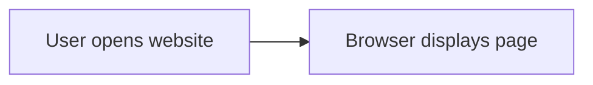
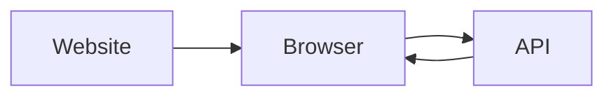
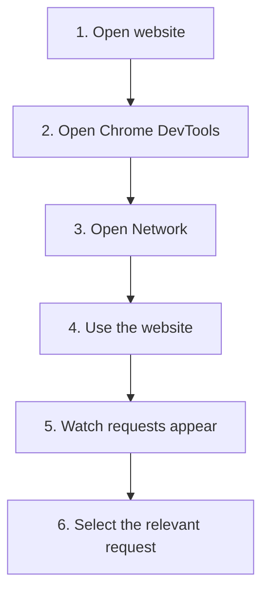
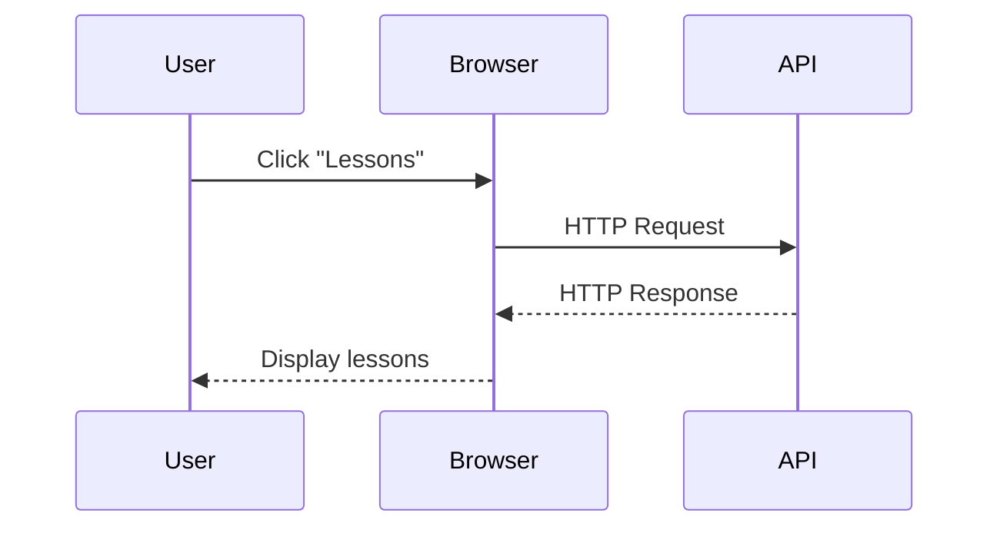
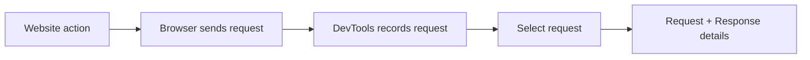
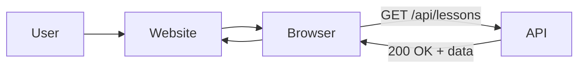

# Lesson 0.2 — Find API Communication in a Browser

> **Module 0 — Discovering RESTful APIs Through Testing**

## Lesson Goal

In the previous lesson, you learned the visible shape of HTTP:

```text
Request
   ↓
API / Server
   ↓
Response
```

Now you will learn how to **find that communication inside a real website** using Chrome DevTools.

The goal is not to learn Chrome DevTools itself.

The goal is:

> **Find the API request made by a website.**

---

## 1. Start With a Website

Imagine you open a course page:



You see:

```text
Course
RESTful API Mastery

Lessons
- Introduction
- HTTP Methods
- Status Codes
```

But where did this information come from?

One possibility is:



The browser may have requested the course data from an API.

---

## 2. How Do We Find It?

Chrome DevTools can record the browser's network activity.

The basic workflow is:



Think of DevTools as a window that lets you **observe what the browser is communicating with servers**.

---

## 3. Open Network

Open Chrome DevTools:

```text
Chrome
  ↓
DevTools
  ↓
Network
```

You will see a list of network activity.

For example:

```text
Name                         Type
────────────────────────────────────
index.html                   document
app.js                       script
main.css                     stylesheet
course.jpg                   image
courses                      fetch
lessons                      fetch
```

There may be many requests.

You are looking for requests that represent application data.

---

## 4. Use the Website

Now perform an action.

For example:

```text
Open Course
     ↓
Click "Lessons"
     ↓
Browser requests lesson data
```

Visualized:



At the same time, Chrome DevTools records the request.

---

## 5. Find the Request

Look at the Network list.

You may see something like:

```text
Name
────────────────────────
document
main.css
app.js
courses
lessons
```

The request you want might be:

```text
lessons
```

Select it.

Now the browser's API communication becomes available for inspection.



---

## 6. What Are You Looking For?

At this stage, do **not** try to understand every field.

Look for the pieces from Lesson 0.1:

```text
REQUEST
├── Method
└── URL

RESPONSE
└── Status
```

For example:

```text
Request Method
GET

Request URL
https://example.com/api/lessons

Status Code
200 OK
```

You have now connected:

```text
WHAT YOU LEARNED
        ↓
WHAT THE BROWSER ACTUALLY DID
```

---

## 7. The Important Discovery

You started with:

```text
User
 ↓
Website
```

But DevTools lets you see:



The API communication was happening **behind the website interface**.

You did not need to build the API.

You did not need to write code.

You simply observed the request made by the browser.

---

## Next Lesson

In **Lesson 0.3 — Read the request and response**, you will take the request you found and learn how to read its:

```text
Method
URL
Status
Headers
Response Body
```

Instead of just finding the request, you will learn how to **understand what the request and response contain**.
