# Your First Look at a RESTful API

> **Module 0-1 — Discovering RESTful APIs Through Testing**

## Lesson Overview

You may already understand RESTful API concepts such as:

- HTTP methods
- Endpoints
- Resources
- Requests
- Responses
- Status codes
- Headers
- JSON

But knowing the theory is different from **seeing those concepts appear in a real tool**.

This lesson is designed to bridge that gap.

You will see how a normal website action can produce a RESTful API request in **Google Chrome DevTools**, and how you can create a request yourself in **Postman**.

The goal is not to memorize tool interfaces.

The goal is to learn how to look at a real tool and recognize:

```text
REQUEST
    ↓
What did the client send?
    ↓
RESPONSE
    ↓
What did the server return?
```

---

## What You Will Learn

By the end of this lesson, you should be able to:

- Understand why Chrome DevTools is useful for discovering API requests.
- Understand why Postman is useful for sending and testing API requests.
- Understand the difference between **observing** a browser request and **creating** a request yourself.
- Recognize where the method, URL, status, headers, and response body appear in a real tool.
- Understand how a visual API result connects to RESTful API theory.
- Read a real Postman result without relying on shorthand such as `GET /api/courses 200 OK`.

---

# 1. From REST Theory to a Real API

You already know that an API communicates through requests and responses.

Instead of starting with a line such as:

```text
GET /api/courses 200 OK
```

start with what actually happens:

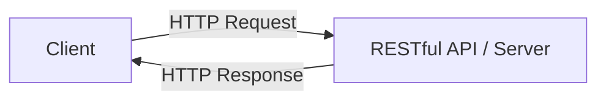

The request and response contain several pieces of information.

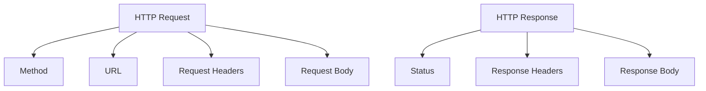

For example, a real request may contain:

```text
Method → GET
URL → https://example.com/api/courses
```

And the response may contain:

```text
Status → 200 OK
Response Body → course data
```

The important point is:

> **The information is normally shown as separate fields inside a tool.**

---

# 2. Where Can We See This Communication?

There are two useful ways to observe this communication.

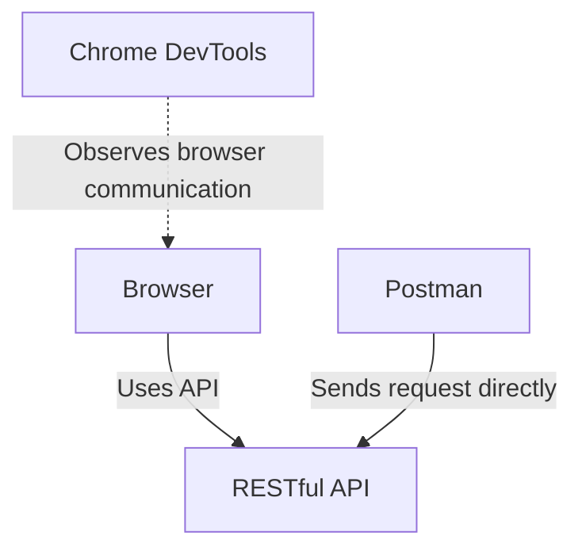

The tools have different starting points.

### Chrome DevTools

You start with the **website**.

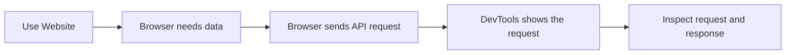

### Postman

You start with the **API request**.

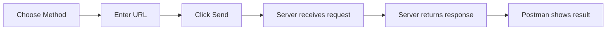

This is the main difference:

| Tool | You start with | What you discover |
|---|---|---|
| Chrome DevTools | A website action | The API request the browser made |
| Postman | An API request | What the API returns when you call it |

---

# 3. Chrome DevTools: Discover the API Behind a Website

Imagine you are using a learning website.

You click:

```text
Load Lessons
```

You see lessons appear on the page.

Something happened behind the scenes.

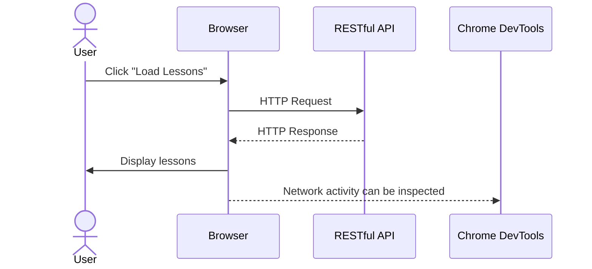

The important discovery is:

> The website may not contain all of the lesson data inside the page itself. The browser may request that data from an API.

Chrome DevTools lets you investigate that request.

---

# 4. What Do You Actually Look For in DevTools?

Open the browser's **Network** panel while using the website.

You may see many network requests.

When you perform an action, a new request may appear.

Think of the investigation like this:

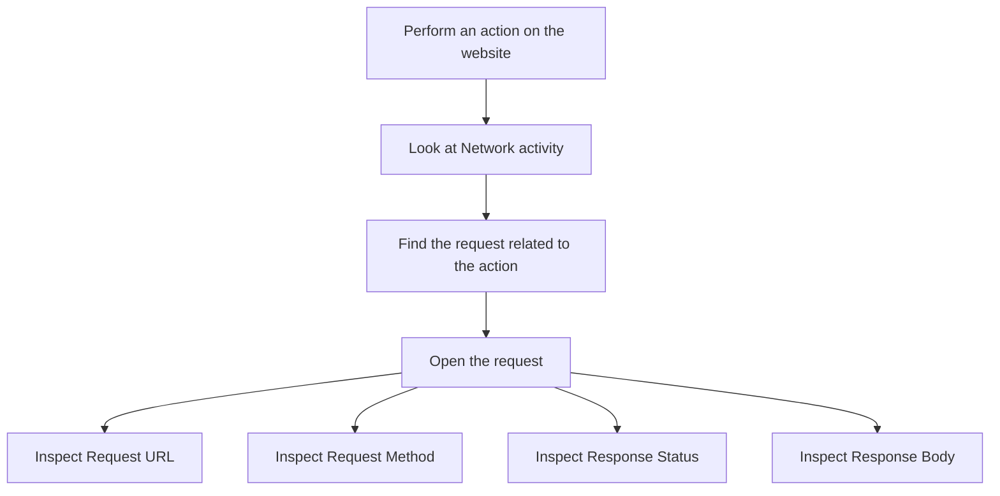

Now the REST theory has a visual location:

| REST concept | Where you look |
|---|---|
| HTTP method | Request Method |
| Endpoint | Part of Request URL |
| Request headers | Request Headers |
| Status code | Response Status |
| Response headers | Response Headers |
| Response data | Response / Response Body |

The purpose of DevTools is therefore simple:

> **Find out what API communication the browser is actually performing.**

---

# 5. What Does `GET /api/courses 200 OK` Actually Mean?

A beginner may encounter shorthand like:

```text
GET /api/courses 200 OK
```

Do not try to understand this as one new format.

It is only a compact summary.

Instead, visualize it as a request followed by a response:

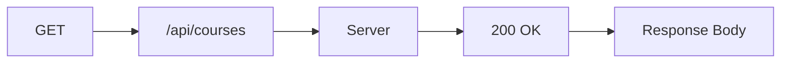

Now expand each part:

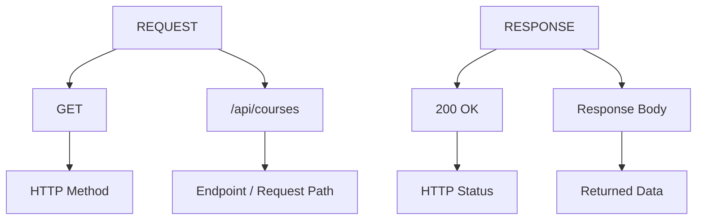

So the shorthand:

```text
GET /api/courses 200 OK
```

means:

```text
The client used GET
        ↓
to request /api/courses
        ↓
the server returned 200 OK
        ↓
and may also return response headers and response data
```

### Important

The shorthand is **not a complete API response**.

A real tool can show much more information.

---

# 6. See the Complete Request and Response

A more realistic view is:

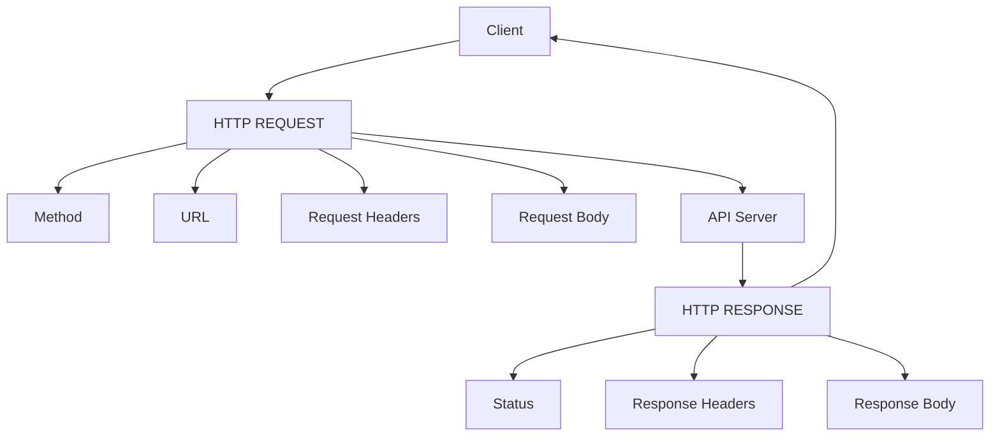

For a simple GET request, the body may be empty.

For example:

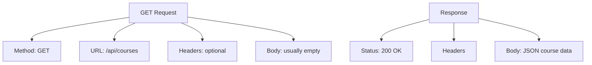

This is much closer to what you will actually encounter in DevTools or Postman.

---

# 7. Why Use Chrome DevTools?

Chrome DevTools is especially useful when you **do not know which API the website is using**.

Suppose this button exists:

```text
[ Load Lessons ]
```

You click it.

The lessons appear.

You want to know:

> Which API provided these lessons?

The investigation becomes:

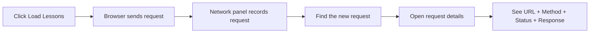

You may discover something like:

```text
Method:
GET

URL:
https://example.com/api/courses/123/lessons

Status:
200 OK
```

and perhaps:

```json
[
  {
    "id": 1,
    "title": "Introduction"
  },
  {
    "id": 2,
    "title": "HTTP Methods"
  }
]
```

Now you can connect the real result to your REST theory:

```text
GET
↓
HTTP method

/api/courses/123/lessons
↓
Endpoint

200 OK
↓
Status code

JSON array
↓
Response body
```

---

# 8. Postman: Create the Request Yourself

Postman works differently.

You do not need to start from a website.

You can create the request yourself.

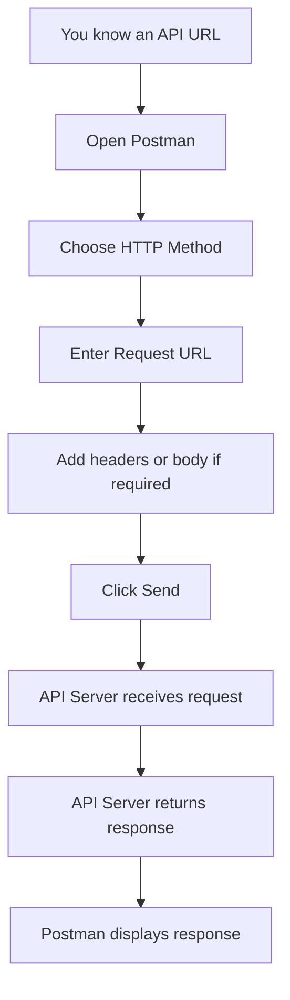

For example:

```text
Method:
GET

URL:
https://httpbin.org/status/404
```

Then:

```text
Click Send
```

Postman sends the HTTP request.

The server returns a response.

Postman displays that response.

The purpose is:

> **You create the request, send it, and inspect what the server returns.**

---

# 9. Visual Example: Real Postman Request

The following screenshot shows an actual Postman request:


Read the screenshot as a sequence.

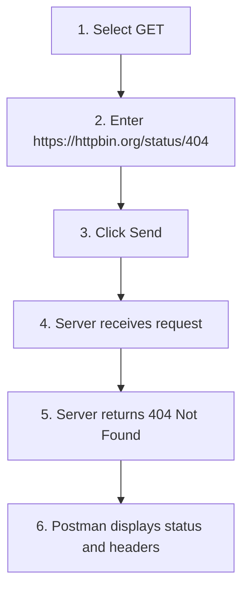

The screenshot is useful because it shows the **actual visual location** of the concepts.

### Request Method

At the top-left of the request:

```text
GET
```

This is the HTTP method.

### Request URL

Next to it:

```text
https://httpbin.org/status/404
```

This is the URL where Postman sends the request.

### Send

The button:

```text
Send
```

causes Postman to actually send the request.

### Response Status

After the request finishes, Postman displays:

```text
404 Not Found
```

This is the server's response status.

---

# 10. Read the Postman Result as Request → Response

Instead of looking at the screenshot as one large interface, follow this path:

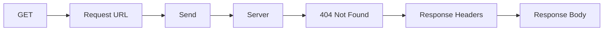

The screenshot therefore represents:

```text
REQUEST
    ↓
GET
    ↓
https://httpbin.org/status/404
    ↓
Send
    ↓
SERVER
    ↓
RESPONSE
    ↓
404 Not Found
    ↓
Headers
    ↓
Body
```

This is the connection between the Postman interface and the RESTful API theory.

---

# 11. What Are Those Response Headers?

The screenshot shows response headers such as:

```text
:status
date
content-type
content-length
server
access-control-allow-origin
access-control-allow-credentials
```

Do not memorize them yet.

Think of headers as **additional information attached to the response**.

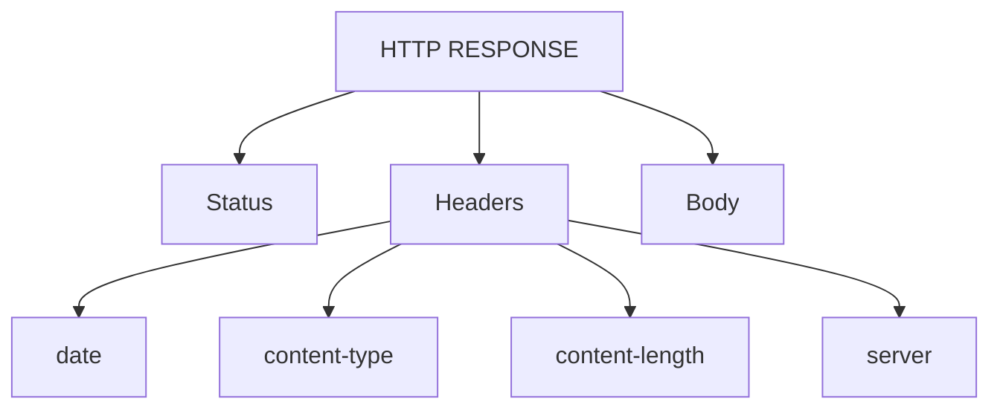

In this example:

```text
Status:
404 Not Found

Headers:
Present

Body:
Empty
```

The screenshot shows:

```text
content-length: 0
```

which indicates that the response body contains zero bytes.

You do not need to understand every header yet.

The important lesson is that:

> **A response is more than just a status code.**

---

# 12. Why Is `404 Not Found` Still a Response?

A common beginner misunderstanding is:

```text
404 = no response
```

That is incorrect.

The server did respond.

The response is:

```text
404 Not Found
```

Visualize it:

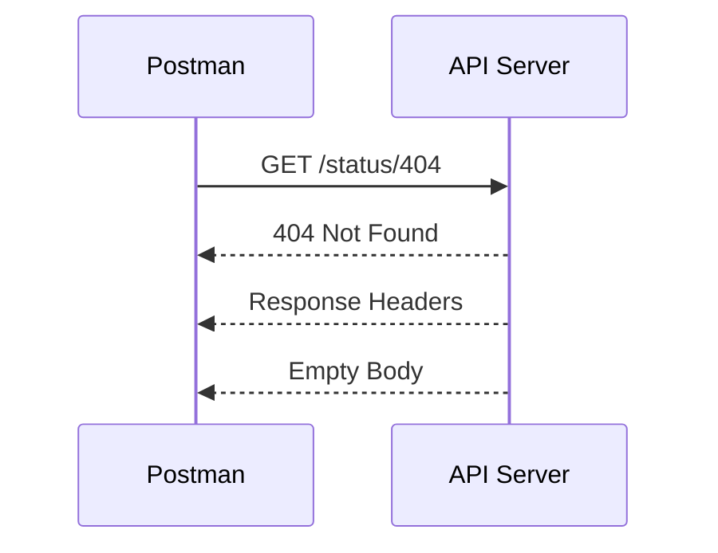

So:

```text
404 Not Found
```

means:

> The server returned an HTTP response indicating that the requested resource was not found.

---

# 13. Success and Failure Have the Same Shape

The request/response structure does not suddenly change when the result is unsuccessful.

### Successful example

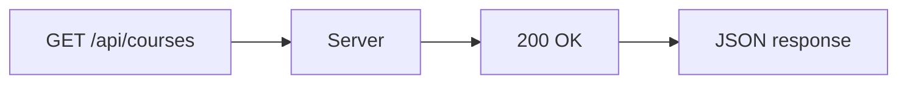

### Not-found example

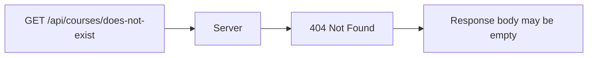

The structure is still:

```text
Request
    ↓
Server
    ↓
Response
```

Only the response result is different.

---

# 14. Chrome DevTools vs Postman

The workflows are different.

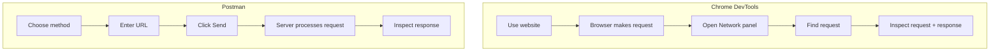

### Chrome DevTools

Use it when you want to discover:

> **What is this website doing behind the scenes?**

### Postman

Use it when you want to test:

> **What happens when I call this API directly?**

---

# 15. The Same REST Theory Appears in Both Tools

Once you know where to look, the tools become much less mysterious.

| REST concept | Chrome DevTools | Postman |
|---|---|---|
| HTTP method | Request Method | Method selector |
| URL | Request URL | URL field |
| Endpoint | Part of Request URL | Part of URL |
| Request headers | Request Headers | Headers |
| Request body | Payload / Request | Body |
| Status code | Response Status | Response status |
| Response headers | Response Headers | Headers |
| Response body | Response | Response body |

The goal is not to memorize the UI.

The goal is to recognize:

```text
Theory
  ↓
Visual evidence
  ↓
Understanding
```

---

# 16. A Better Way to Read API Results

Whenever you see an API request in a tool, read it in this order:

```mermaid
flowchart TD
    A["1. What method?"] --> B["2. What URL?"]
    B --> C["3. What happened?"]
    C --> D["4. What status?"]
    D --> E["5. What headers?"]
    E --> F["6. What response body?"]
```

Ask:

### 1. What method?

```text
GET?
POST?
PUT?
PATCH?
DELETE?
```

### 2. What URL?

```text
Where was the request sent?
```

### 3. What happened?

```text
Did the server receive and process the request?
```

### 4. What status?

```text
200?
201?
400?
401?
403?
404?
500?
```

### 5. What headers?

```text
What additional information was returned?
```

### 6. What response body?

```text
What data did the server return?
```

This gives you a repeatable way to inspect APIs.

---

# 17. Beginner Exercise

Imagine Postman shows:

```text
Method:
GET

URL:
https://example.com/api/courses

Status:
200 OK

Response Body:
{
  "title": "RESTful API Mastery",
  "level": "beginner"
}
```

Do not memorize the block.

Read it visually as:

```mermaid
flowchart TB
    A["GET"] --> B["https://example.com/api/courses"]
    B --> C["Server"]
    C --> D["200 OK"]
    D --> E["JSON Response Body"]
```

Now answer:

1. What method was used?
2. Where was the request sent?
3. What status did the server return?
4. What data came back?

### Answers

1. `GET`
2. `https://example.com/api/courses`
3. `200 OK`
4. Course title and level

---

# 18. Common Beginner Misunderstandings

### "I know GET theoretically, but where do I see GET?"

In DevTools, look at **Request Method**.

In Postman, look at the **method selector**.

### "I know the endpoint theoretically, but where do I see it?"

Look at the **Request URL**.

For example:

```text
https://example.com/api/courses
```

The path is:

```text
/api/courses
```

### "Where does 200 OK appear?"

It appears as the **response status**.

### "Is `GET /api/courses 200 OK` the entire response?"

No.

It is only a compact summary:

```mermaid
flowchart TB
    A["GET"] --> A2["Request Method"]
    B["/api/courses"] --> B2["Request Endpoint"]
    C["200 OK"] --> C2["Response Status"]
```

A real response may also contain:

```text
Response Headers
Response Body
```

### "Is Postman the API?"

No.

Postman is a client/tool that sends requests to an API.

### "Does Chrome DevTools create the API request?"

Normally, the browser creates and sends the request.

DevTools lets you inspect it.

### "Does every response contain JSON?"

No.

A response may contain:

- JSON
- HTML
- Plain text
- A file
- An image
- An empty body

---

# 19. Lesson Summary

The purpose of this lesson is to connect **RESTful API theory with visible evidence**.

### Chrome DevTools

```text
Website action
      ↓
Browser sends API request
      ↓
DevTools shows request
      ↓
Inspect request + response
```

### Postman

```text
Choose method
      ↓
Enter URL
      ↓
Send request
      ↓
Server returns response
      ↓
Inspect result
```

The core structure is:

```mermaid
flowchart LR
    A[Request] --> B[API Server]
    B --> C[Response]
```

And inside those:

```mermaid
flowchart TB
    R[REQUEST]
    R --> R1[Method]
    R --> R2[URL]
    R --> R3[Headers]
    R --> R4[Body]

    S[RESPONSE]
    S --> S1[Status]
    S --> S2[Headers]
    S --> S3[Body]
```

The compact notation:

```text
GET /api/courses 200 OK
```

is simply a shorthand representation of:

```text
GET
    ↓
Request method

/api/courses
    ↓
Request endpoint

200 OK
    ↓
Response status
```

The next step is to stop looking at API communication as abstract text and start **finding the same information inside a real browser and Postman interface**.

---

# Next Lesson

In the next lesson, you will use **Chrome DevTools** for the first time.

You will follow this real workflow:

```mermaid
flowchart LR
    A["Open a website"] --> B["Trigger an action"]
    B --> C["Open Network"]
    C --> D["Find the API request"]
    D --> E["Open request"]
    E --> F["Identify Method + URL"]
    F --> G["Identify Status + Response"]
```

The goal is simple:

> **See a RESTful API request happen in a real browser, find it in DevTools, and recognize the REST concepts you already know.**
