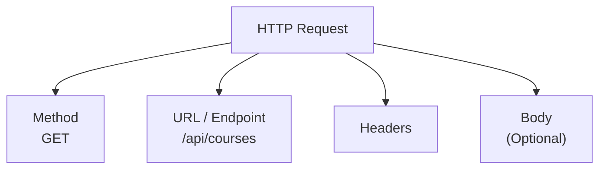
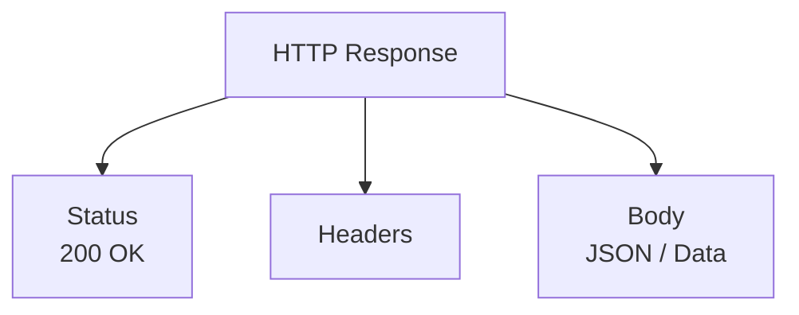
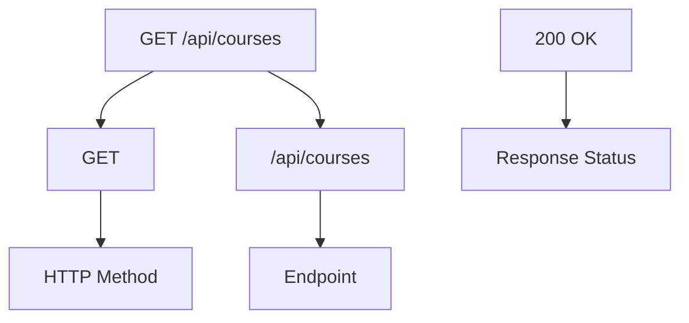
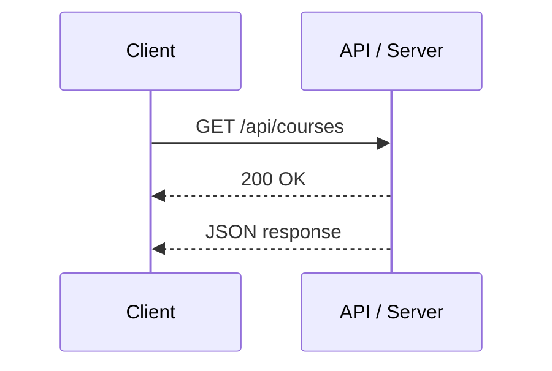
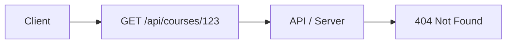

# Lesson 0.1 — Understand the Visible Shape of HTTP

> **Module 0 — Discovering RESTful APIs Through Testing**

## Lesson Goal

You already know RESTful API concepts from theory.

Now connect those concepts to what you will actually see in an API tool.

The key idea:

```text
HTTP Request
      ↓
API / Server
      ↓
HTTP Response
```

---


## 1. The Shape of an HTTP Request

A request contains information that tells the server what the client wants.



For example:

```text
GET https://example.com/api/courses
```

Read it as:

```text
GET
 ↓
What action?

https://example.com/api/courses
 ↓
Where?
```

---


## 2. The Shape of an HTTP Response

The server sends a response back.



For example in Body JSON:

```json
{
  "title": "RESTful API Mastery",
  "level": "beginner"
}
```

The response tells the client:

```text
Did it work?
What information came back?
```

---

## 3. Read This Correctly

You may see a summary like:

```text
GET /api/courses
200 OK
```

Do **not** treat it as one mysterious format.

Break it into:



So:

```text
GET
↓
Method

/api/courses
↓
Endpoint

200 OK
↓
Response Status
```

---

## 4. The Complete HTTP Picture



Think of it as:

```text
CLIENT
  │
  │  Request
  │  GET + URL
  ▼
API / SERVER
  │
  │  Response
  │  Status + Data
  ▼
CLIENT
```

---

## 5. What You Will See in Real Tools

Chrome DevTools and Postman do not normally show everything as:

```text
GET /api/courses
200 OK
```

They separate the information:

```text
REQUEST
├── Method: GET
├── URL: https://example.com/api/courses
└── Headers / Body

RESPONSE
├── Status: 200 OK
├── Headers
└── Body: JSON
```

This is what you will learn to recognize in the next lessons.

---


## 6. One Example

Suppose you see:

```text
GET /api/courses/123
404 Not Found
```

Translate it:



Meaning:

```text
GET
→ Request method

/api/courses/123
→ Endpoint

404 Not Found
→ Response status
```

The server **did respond**. The response says that the requested resource was not found.

---

## Takeaway

Remember only this structure:

```text
REQUEST
├── Method
├── URL
├── Headers
└── Body

        ↓

API / SERVER

        ↓

RESPONSE
├── Status
├── Headers
└── Body
```

The purpose of the next lessons is to **find these pieces in real Chrome DevTools and Postman interfaces**.
