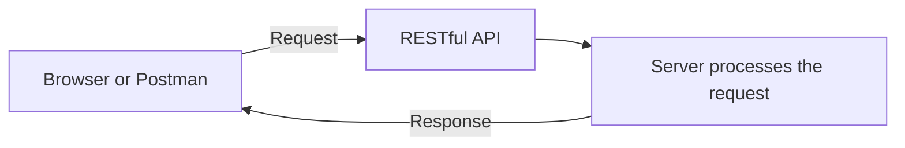
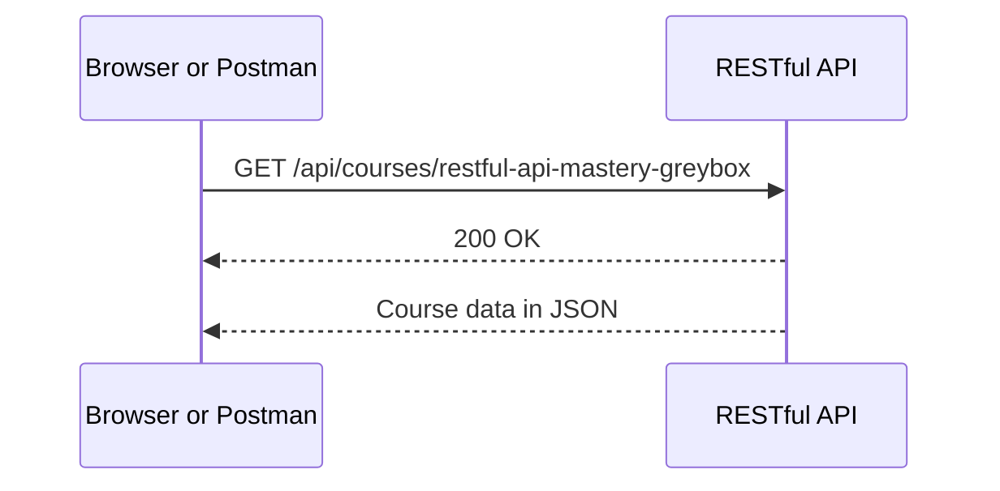
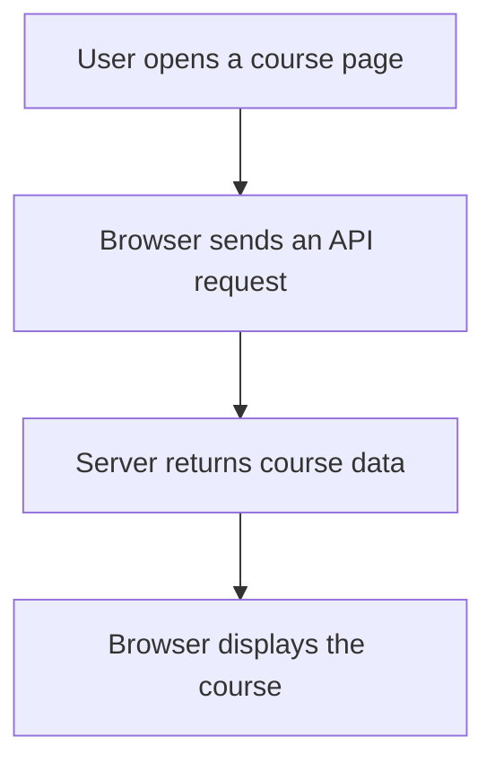

# Your First Look at a RESTful API

> **Module 0 — Discovering RESTful APIs Through Testing**

## Lesson Overview

When you open a course page, the browser may need to ask a server for information such as:

- The course title
- The course description
- The lesson list
- Your learning progress

This communication can happen through an API.

In this lesson, you will learn the basic RESTful API pattern by looking at requests and responses. Later, you will observe this pattern with Chrome DevTools and test it directly with Postman.

No programming or API experience is required.

---

## What You Will Learn

By the end of this lesson, you should be able to:

- Explain what an API does.
- Recognize a client, request, server, and response.
- Recognize an endpoint and HTTP method.
- Understand the basic meaning of a status code.
- Recognize JSON data returned by an API.
- Explain how Chrome DevTools and Postman help us test APIs.

---

## 1. A Simple Website Example

Imagine that you open a course page.

The page shows:

- A course title
- A description
- A difficulty level
- A list of lessons

The browser may ask a server:

> Please send me the course information.

The server may answer:

> Here is the course information.

The browser then displays the returned information on the page.

---

## 2. The Basic API Flow



If Mermaid is not supported, use this text version:

```text
Client
  |
  | Request
  v
RESTful API / Server
  |
  | Response
  v
Client
```

The basic pattern is:

```text
Client sends a request.
Server processes the request.
Server returns a response.
```

---

## 3. Important Beginner Terms

| Term | Simple meaning |
|---|---|
| Client | An application that sends a request |
| Server | A system that receives and processes the request |
| Request | A message asking the server for data or an action |
| Response | The result returned by the server |
| API | A structured way for applications to communicate |
| RESTful API | An API that works with resources through HTTP |
| Resource | Something managed by the API, such as a course or lesson |
| Endpoint | The address used to access an API resource |
| HTTP method | The type of action requested |
| Status code | A number that describes the request result |

Examples of clients:

- A web browser
- A mobile application
- Postman
- Another software system

---

## 4. What Is an API?

API stands for **Application Programming Interface**.

For now, use this simple definition:

> An API is a structured way for one application to request data or actions from another system.

Example:

```text
Browser:
Give me the available courses.

API:
Here is the course list.
```

Postman can also send a request:

```text
Postman:
Give me information about one course.

API:
Here is the requested course.
```

The browser and Postman are clients.

They are not the API.

---

## 5. What Is a RESTful API?

A RESTful API organizes communication around resources.

Resources in a learning platform may include:

- Courses
- Lessons
- Users
- Submissions
- Quiz results

A client can use HTTP requests to retrieve or change these resources.

For this lesson, remember:

> A RESTful API is a structured way to access and manage resources through HTTP.

You will learn the detailed REST rules later.

---

## 6. Your First RESTful API Request

Consider this request:

```http
GET /api/courses/restful-api-mastery-greybox
```

This request has two important parts.

### HTTP Method

```text
GET
```

`GET` commonly means:

> Retrieve information.

### Endpoint

```text
/api/courses/restful-api-mastery-greybox
```

The endpoint tells us where the request is sent.

In simple language, the complete request means:

> Retrieve information about the RESTful API Mastery course.

---

## 7. Your First RESTful API Response

The server may return this status:

```text
200 OK
```

This usually means:

> The request succeeded.

The server may also return this response body:

```json
{
  "slug": "restful-api-mastery-greybox",
  "title": "RESTful API Mastery: The Greybox Approach",
  "level": "beginner"
}
```

This response uses JSON.

> JSON is a common text format used by APIs to organize data using names and values.

In this example:

- `slug` is the course identifier.
- `title` is the course title.
- `level` is the difficulty level.

---

## 8. Complete Request and Response Diagram



Text version:

```text
Browser or Postman
        |
        | GET /api/courses/restful-api-mastery-greybox
        v
RESTful API
        |
        | 200 OK
        | Course data in JSON
        v
Browser or Postman
```

From this test result, we can identify:

| Evidence | Result |
|---|---|
| Client | Browser or Postman |
| Method | GET |
| Endpoint | `/api/courses/restful-api-mastery-greybox` |
| Status | `200 OK` |
| Response | Course data in JSON |

A useful pattern to remember is:

```text
Method + Endpoint + Status + Response
```

---

## 9. Successful and Unsuccessful Results

### Successful Request

```text
GET /api/courses/restful-api-mastery-greybox
200 OK
```

Meaning:

> The server found the requested course and processed the request successfully.

### Resource Not Found

```text
GET /api/courses/course-that-does-not-exist
404 Not Found
```

Meaning:

> The server could not find the requested resource.

A `404 Not Found` result does not automatically mean that the entire server is broken.

It only tells us that this request did not find the requested endpoint or resource.

---

## 10. How Chrome DevTools Helps

Chrome DevTools can show API requests made by the browser.

For example:



With Chrome DevTools, you can inspect:

- The request URL
- The HTTP method
- The status code
- The request headers
- The response headers
- The returned data

The main question is:

> What API request did the browser send?

You will practice this in the next lesson.

---

## 11. How Postman Helps

Postman allows you to send an API request directly.

A simple Postman test may use:

```text
Method:
GET

URL:
https://example.com/api/courses

Action:
Send
```

Postman can display:

- The status code
- The response headers
- The response body
- The response time

The main question is:

> What happens when I send this request directly to the API?

---

## 12. Chrome DevTools and Postman

| Chrome DevTools | Postman |
|---|---|
| Observes requests made by the browser | Sends requests directly |
| Starts from a website action | Starts from a request created by the tester |
| Helps explain application behavior | Helps test the API without the website interface |

Both tools help us understand the same RESTful API interaction from different starting points.

---

## 13. Guided Exercise

Examine this test result:

```text
Request Method:
GET

Request URL:
https://example.com/api/courses/restful-api-mastery-greybox

Status Code:
200 OK
```

Response:

```json
{
  "slug": "restful-api-mastery-greybox",
  "title": "RESTful API Mastery: The Greybox Approach",
  "level": "beginner"
}
```

Answer these questions:

1. Which HTTP method was used?
2. Which endpoint was requested?
3. Did the request succeed?
4. Which status code provides the evidence?
5. What data did the server return?

<details>
<summary>Show answers</summary>

1. The method was `GET`.
2. The endpoint was `/api/courses/restful-api-mastery-greybox`.
3. Yes, the request succeeded.
4. The evidence was `200 OK`.
5. The server returned the course slug, title, and level.

</details>

---

## 14. Common Beginner Misunderstandings

### “The website is the API”

The website interface may use an API, but the interface and API are not the same thing.

### “Postman is the API”

Postman is a client used to send requests to an API.

### “Chrome DevTools creates the API request”

Chrome DevTools mainly helps you observe requests made by the browser.

### “Every failed request means the server is broken”

A request may fail because of:

- An incorrect endpoint
- A missing resource
- Invalid input
- Missing authentication
- Missing permission
- A server problem

Always inspect the method, endpoint, status code, and response.

### “RESTful API means JSON”

JSON is commonly used by RESTful APIs, but RESTful APIs are not defined only by JSON.

---

## 15. Lesson Summary

A RESTful API allows a client to communicate with a server through HTTP requests and responses.

The client sends:

- An HTTP method
- An endpoint
- Optional headers or data

The server returns:

- A status code
- Response headers
- Optional response data

Chrome DevTools helps you observe requests made by a browser.

Postman helps you send requests directly.

The basic evidence pattern is:

```text
Method + Endpoint + Status + Response
```

---

## Next Lesson

In the next lesson, you will use Chrome DevTools to observe a RESTful API request inside a real web application.

You will identify:

- The request URL
- The HTTP method
- The status code
- The returned response data
