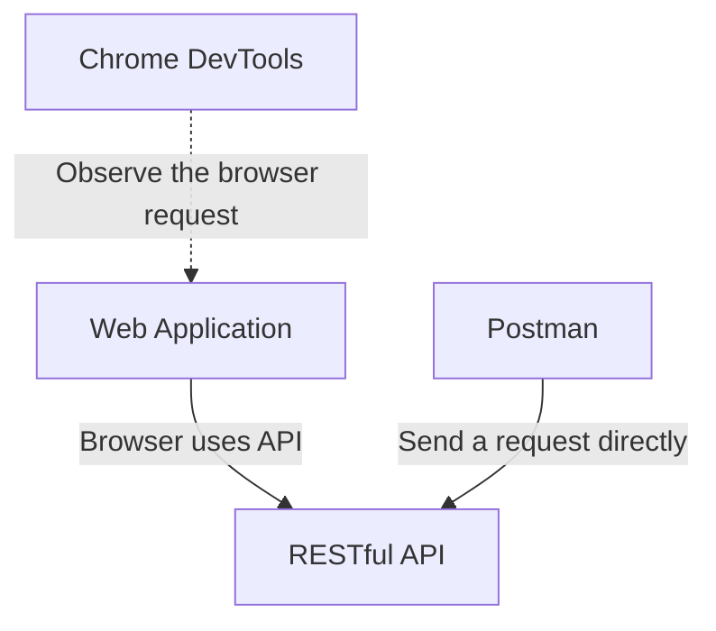
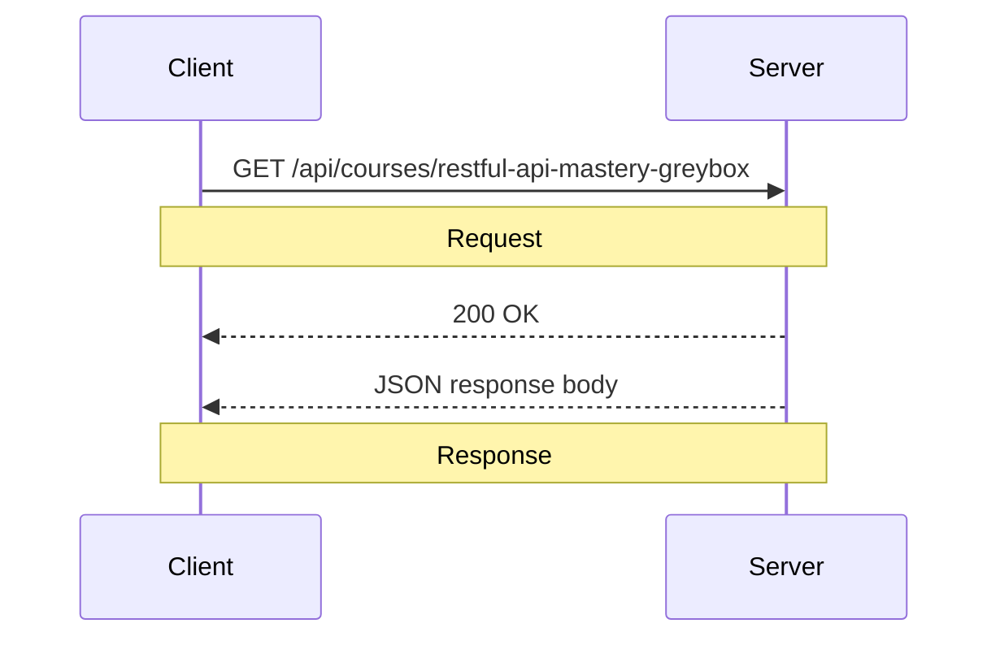
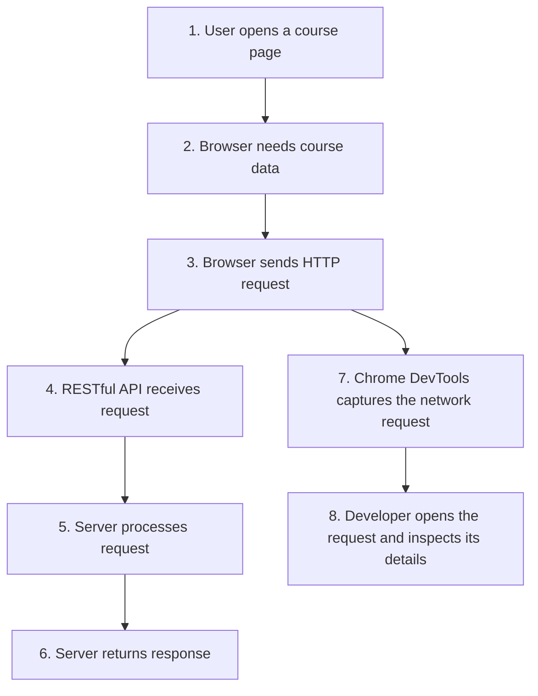
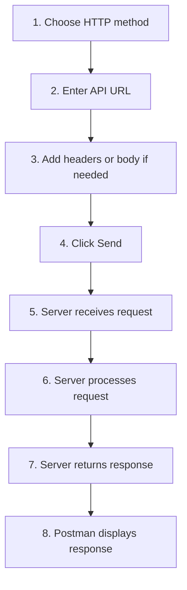
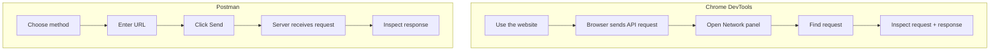

# Your First Look at a RESTful API

> **Module 0-1 — Discovering RESTful APIs Through Testing**

## Lesson Overview

You may already understand RESTful API concepts such as HTTP methods, endpoints, resources, requests, responses, status codes, headers, and JSON.

But knowing the theory is different from **seeing an API request happen in a real application**.

This lesson connects the theory you already know to what you can actually see in:

- **Google Chrome DevTools**
- **Postman**

The goal is not to teach these tools as products.

The goal is to answer:

> **Where can I actually see the RESTful API concepts I learned in theory?**

By the end of this lesson, you should be able to look at a browser or Postman and recognize:

```text
What did the client send?
        ↓
Where was it sent?
        ↓
What did the server return?
        ↓
What data came back?
```

---

## What You Will Learn

By the end of this lesson, you should be able to:

- Understand why developers use Chrome DevTools to investigate RESTful APIs.
- Understand why developers use Postman to test RESTful APIs.
- Understand the difference between **observing** an API request and **sending** an API request.
- Find the HTTP method, URL, status code, headers, and response body in a tool.
- Understand what a compact example such as `GET /api/courses 200 OK` actually represents.
- Connect what you see in a tool to the RESTful API theory you already know.

---

# 1. You Know the Theory — Now See It

You may already know that an HTTP request conceptually contains:

```text
Method + URL + Headers + Body
```

And that the server returns:

```text
Status + Headers + Body
```

For example:

```http
GET /api/courses
```

may produce:

```text
200 OK
```

with a response body such as:

```json
{
  "courses": [
    {
      "id": 1,
      "title": "RESTful API Mastery"
    }
  ]
}
```

The problem is often not understanding these concepts individually.

The problem is:

> **Where do I actually see them?**

That is where Chrome DevTools and Postman become useful.

---

# 2. The Two Tools Have Different Jobs

Think of the two tools as two different windows into the same API.



### Chrome DevTools

Chrome DevTools helps you answer:

> **"What API request did this website just make?"**

You normally start with a website action.

```text
Open course page
       ↓
Browser needs course data
       ↓
Browser sends API request
       ↓
Chrome DevTools shows the request
```

### Postman

Postman helps you answer:

> **"What happens if I send this API request myself?"**

You normally start with the API request.

```text
Choose GET
       ↓
Enter API URL
       ↓
Click Send
       ↓
Server receives request
       ↓
Postman shows the response
```

The key distinction is:

| Tool | Starting point | Main purpose |
|---|---|---|
| Chrome DevTools | A website action | Observe what the browser sends |
| Postman | An API request | Send and inspect the API directly |

---

# 3. What Does an API Request Look Like in Real Life?

A beginner may see:

```text
GET /api/courses/restful-api-mastery-greybox
200 OK
```

This can look like one mysterious piece of information.

It is actually a **short summary of several pieces of HTTP information**:

```text
GET
↓
Request Method

/api/courses/restful-api-mastery-greybox
↓
Request Path / Endpoint

200 OK
↓
Response Status
```

A real tool usually shows these pieces separately.

For example:

```text
REQUEST

Method:
GET

URL:
https://example.com/api/courses/restful-api-mastery-greybox


RESPONSE

Status:
200 OK

Headers:
...

Body:
{
  "slug": "restful-api-mastery-greybox",
  "title": "RESTful API Mastery",
  "level": "beginner"
}
```

So:

```text
GET /api/courses/restful-api-mastery-greybox 200 OK
```

is **not normally the entire HTTP response**.

It is simply a compact way of saying:

> A GET request was sent to this endpoint, and the server returned 200 OK.

---

# 4. The Real Request/Response Picture

Here is the complete mental model:



The client could be:

- A browser
- Postman
- A mobile application
- Another backend service

The RESTful API itself is not the tool.

The tool helps you **see or create the communication**.

---

# 5. Chrome DevTools: From Website Action to API Result

Chrome DevTools is useful when an API call happens **because of something you do on a website**.

Imagine a learning website.

You open:

```text
Course → RESTful API Mastery
```

The browser needs course data.

The process looks like this:



You are not manually creating the request.

You are using the website normally.

For example:

```text
Open course page
```

Then Chrome DevTools lets you inspect what happened behind the scenes.

---

# 6. What You Look For in Chrome DevTools

When you open the browser's **Network** panel, you may see many requests.

Your job is to find the request related to the action you just performed.

Conceptually, you may find:

```text
Name:
courses/restful-api-mastery-greybox

Method:
GET

Status:
200
```

When you open that request, you can inspect:

```text
Headers
    ↓
Request URL
Request Method
Request Headers

Response
    ↓
Response Headers
Response Body
```

This is where RESTful API theory becomes visible.

### Theory → DevTools

| REST theory | What you may see in DevTools |
|---|---|
| HTTP method | `GET` |
| Endpoint | URL / Request URL |
| Request headers | Request Headers |
| Status code | `200 OK` |
| Response headers | Response Headers |
| Response body | JSON / text / other data |

So DevTools answers:

> **"Show me the API request that the browser actually made."**

---

# 7. Why Would I Use Chrome DevTools?

Suppose clicking **"Load Lessons"** displays a list of lessons.

You do not know which API endpoint provides those lessons.

Instead of guessing:

```mermaid
flowchart LR
    A[Click "Load Lessons"] --> B[Browser sends request]
    B --> C[Open Network in DevTools]
    C --> D[Find the new request]
    D --> E[Inspect URL + Method + Status + Response]
    E --> F[Discover the API used by the website]
```

You might discover:

```text
GET
https://example.com/api/courses/123/lessons

200 OK
```

And the response:

```json
[
  {
    "id": 1,
    "title": "Introduction"
  },
  {
    "id": 2,
    "title": "HTTP Methods"
  }
]
```

Now the theory becomes visible:

```text
GET
    ↓
HTTP method

/api/courses/123/lessons
    ↓
Endpoint

200 OK
    ↓
Status code

JSON array
    ↓
Response body
```

---

# 8. Postman: From API Request to API Result

Postman starts from the opposite direction.

Instead of opening a website first, you already have an API endpoint that you want to test.

The flow is:



The important idea is:

> **Postman lets you create the client request yourself and see exactly what the server returns.**

---

# 9. What Does Postman Actually Show?

Suppose you want to test:

```text
https://httpbin.org/status/404
```

In Postman you select:

```text
GET
```

and enter:

```text
https://httpbin.org/status/404
```

Then click:

```text
Send
```

Postman sends:

```http
GET https://httpbin.org/status/404
```

The server returns:

```text
404 Not Found
```

Postman then displays the result.

Postman is not creating a new kind of API communication.

It gives you a visual interface for the HTTP communication you already learned in theory.

---

# 10. Visual Example: A Real Postman Request

The following screenshot shows a real Postman request:


The screenshot can be understood from **top to bottom**.

### Request Method

At the top left:

```text
GET
```

This is the HTTP method.

### Request URL

Next to it:

```text
https://httpbin.org/status/404
```

This is the URL where Postman sends the request.

So the request is:

```text
Method:
GET

URL:
https://httpbin.org/status/404
```

### Send

When you click:

```text
Send
```

Postman sends the request to the server.

### Response Status

The response area shows:

```text
404 Not Found
```

This is the response status.

The server is saying:

> The request was processed, but the requested resource was not found.

A `404` **is itself a response**.

---

# 11. Now Look at the Response Headers

The screenshot also shows response headers:

```text
:status
date
content-type
content-length
server
access-control-allow-origin
access-control-allow-credentials
```

You do not need to memorize these yet.

For now, understand the structure:

```text
Response
├── Status
├── Headers
└── Body
```

In this particular example:

```text
Status:
404 Not Found

Headers:
Present

Body:
Empty
```

The header:

```text
content-length: 0
```

helps explain why there is no response body.

---

# 12. Translate the Postman Screenshot Into REST Theory

The screenshot can be translated into:

```text
REQUEST
│
├── Method
│   └── GET
│
└── URL
    └── https://httpbin.org/status/404


RESPONSE
│
├── Status
│   └── 404 Not Found
│
├── Headers
│   ├── :status
│   ├── date
│   ├── content-type
│   ├── content-length
│   └── ...
│
└── Body
    └── Empty
```

This is the important connection:

```text
Postman UI
    ↓
HTTP information
    ↓
RESTful API concepts you already know
```

---

# 13. Why Is This Example 404?

The endpoint:

```text
https://httpbin.org/status/404
```

is intentionally used to return:

```text
404 Not Found
```

This makes it easy to see that:

> A server can receive and process a request while returning an unsuccessful result.

Compare:

```text
GET /some-resource
200 OK
```

with:

```text
GET /some-resource
404 Not Found
```

Both are HTTP responses.

The difference is what the status tells us.

---

# 14. Success and Failure Use the Same Structure

Instead of memorizing:

```text
GET /api/courses 200 OK
```

think about the actual structure:

```text
REQUEST
    ↓
Method + URL
    ↓
Server
    ↓
RESPONSE
    ↓
Status + Headers + Body
```

### Successful response

```text
Method:
GET

URL:
/api/courses/restful-api-mastery-greybox

Status:
200 OK

Body:
{
  "slug": "restful-api-mastery-greybox",
  "title": "RESTful API Mastery"
}
```

### Not-found response

```text
Method:
GET

URL:
/api/courses/does-not-exist

Status:
404 Not Found

Body:
Possibly empty or an error representation
```

The **structure is the same**.

Only the returned result is different.

---

# 15. Chrome DevTools vs Postman



### Chrome DevTools

```text
Website action
    ↓
Browser creates request
    ↓
DevTools lets you inspect it
```

### Postman

```text
You create request
    ↓
Postman sends it
    ↓
Postman lets you inspect response
```

But both eventually expose the same RESTful API concepts:

```text
Method
URL / Endpoint
Headers
Status
Response Body
```

---

# 16. When Should You Use Each Tool?

### Use Chrome DevTools when you want to know:

> **"What is this website doing behind the scenes?"**

Examples:

- Which API loads the course list?
- Which endpoint loads a lesson?
- What request is sent when I click a button?
- What data did the website receive?

### Use Postman when you want to know:

> **"What happens when I call this API directly?"**

Examples:

- Does this endpoint work?
- What status code does it return?
- What does the response body look like?
- What headers does the server return?
- What happens if I change the endpoint or request?

---

# 17. The Important Mental Model

Do not think:

```text
RESTful API
    ↓
Postman
```

Postman is not part of REST itself.

Instead:

```text
                    RESTful API
                         ▲
                         │
          ┌──────────────┴──────────────┐
          │                             │
      Browser                       Postman
          │                             │
    Website action               Manual request
          │                             │
          └──────────────┬──────────────┘
                         │
                  HTTP Request
                         │
                         ▼
                    API Server
                         │
                         ▼
                  HTTP Response
```

Chrome DevTools sits beside the browser and lets you inspect that browser communication:

```text
Browser
   │
   ├── sends request ───────────→ API
   │
   └── DevTools observes it
```

---

# 18. From Theory to What You Actually See

You already know the theory.

Now connect each concept to its visual location.

| Theory | Chrome DevTools | Postman |
|---|---|---|
| HTTP method | Request Method | Method dropdown |
| URL | Request URL | URL field |
| Endpoint | Part of Request URL | Part of URL |
| Request headers | Request Headers | Headers |
| Status code | Status | Response status |
| Response headers | Response Headers | Headers |
| Response body | Response tab/body | Response body |
| Request body | Request Payload | Body |

This is the bridge between:

```text
REST theory
```

and:

```text
Actual tool usage
```

---

# 19. Beginner Exercise: Read the Result

Look at this simplified result:

```text
REQUEST

Method:
GET

URL:
https://example.com/api/courses


RESPONSE

Status:
200 OK

Body:
{
  "title": "RESTful API Mastery",
  "level": "beginner"
}
```

Do not read it as one strange block.

Read it step by step.

### Step 1 — What did the client do?

```text
GET
```

The client requested information.

### Step 2 — Where did it send the request?

```text
https://example.com/api/courses
```

This is the request URL.

### Step 3 — What did the server say?

```text
200 OK
```

The request was successful.

### Step 4 — What did the server return?

```json
{
  "title": "RESTful API Mastery",
  "level": "beginner"
}
```

That is the response body.

So the compact notation:

```text
GET /api/courses 200 OK
```

simply summarizes:

```text
GET
+
/api/courses
+
200 OK
```

It is a summary of the request and result, not a replacement for the full request/response structure.

---

# 20. Common Beginner Misunderstandings

### "I know GET theoretically, but where do I see GET?"

In Chrome DevTools, look at the request's **Method**.

In Postman, look at the **method dropdown**.

### "I know an endpoint theoretically, but where do I see it?"

Look at the **Request URL**.

For example:

```text
https://example.com/api/courses
```

The endpoint path is:

```text
/api/courses
```

### "I know 200 OK theoretically, but where does it appear?"

It appears as the **response status**.

For example:

```text
200 OK
```

### "Is `GET /api/courses 200 OK` the actual response?"

No.

It is a compact summary:

```text
GET
    ↓
Request method

/api/courses
    ↓
Request endpoint

200 OK
    ↓
Response status
```

The actual response may additionally contain:

```text
Response headers
Response body
```

### "Is Postman the API?"

No.

Postman is a client/tool used to send requests to an API.

### "Does Chrome DevTools send the API request?"

Normally, the browser sends the request.

Chrome DevTools lets you observe and inspect it.

### "Does every response contain JSON?"

No.

A response may contain:

- JSON
- HTML
- Plain text
- A file
- An image
- An empty body

---

# 21. Lesson Summary

The important lesson is not memorizing Postman or Chrome DevTools.

The important lesson is learning to **recognize RESTful API communication when you see it**.

### Chrome DevTools

```text
Use website
    ↓
Browser makes API request
    ↓
DevTools captures request
    ↓
Inspect request + response
```

### Postman

```text
Choose method
    ↓
Enter URL
    ↓
Send request
    ↓
Server returns response
    ↓
Inspect response
```

Both tools expose the same fundamental HTTP information:

```text
REQUEST
├── Method
├── URL
├── Headers
└── Body

RESPONSE
├── Status
├── Headers
└── Body
```

The compact notation:

```text
GET /api/courses 200 OK
```

should now be understood as:

```text
GET
    ↓
Request method

/api/courses
    ↓
Request endpoint

200 OK
    ↓
Response status
```

---

# Next Lesson

In the next lesson, you will use **Chrome DevTools** for the first time.

You will start from a real website action:

```text
Open a page
    ↓
Trigger an action
    ↓
Watch the Network panel
    ↓
Find the API request
    ↓
Open the request
    ↓
Identify Method + URL + Status + Response
```

The goal is simple:

> **See a RESTful API request happen in a real browser instead of only reading about it in theory.**
